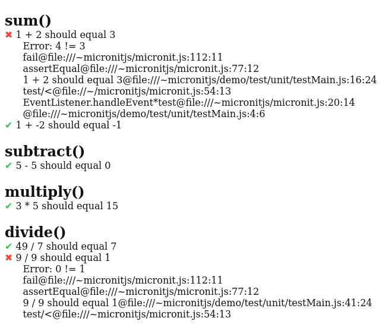

# micronit.js

micronit.js is a minimal unit testing library for Javascript that works entirely in the browser and has no dependencies.

[How to get it](#how-to-get-it) • [Usage](#usage) • [Adding assertions](#adding-assertions) • [TODO](#todo) • [Contributing](#contributing)

## How to get it

```console
$ gh repo clone tekinosman/micronitjs
$
```

or

[Download micronit.js](https://raw.githubusercontent.com/tekinosman/micronitjs/main/micronit.js)

## Usage

Put

```html
<script src="<path_to_micronit>"></script>
<script src="<path_to_function(s)>"></script>
<script src="<path_to_unit_tests>"></script>
```

in the head of any HTML page and add a `micronit` id to the element where you want test results to be shown.

For example, assuming the following folder structure:

    <project_root>
      index.html
      main.js
      micronit.js
      test
        unit
          testMain.js

index.html:

```html
<html>

<head>
    <!-- The micronit library -->
    <script src="../micronit.js"></script>

    <!-- The function(s) to be tested -->
    <script src="main.js"></script>

    <!-- Where unit tests are written -->
    <script src="test/unit/testMain.js"></script>
</head>

<!-- Where test results are shown -->
<body id="micronit"></body>

</html>
```

main.js:

```javascript
function sum(n, m) {
    return n + m;
}

function subtract(n, m) {
    return n - m;
}

function multiply(n, m) {
    return n * m;
}

function divide(n, m) {
    return n / m;
}
```

test/unit/testMain.js:

```javascript
// Import the needed assertions
let assertEqual = unit.assertEqual;

unit.test({
    // This is the category or function being tested
    "sum()":
    {
        /* A description of what the function is supposed to do
         *  given the inputs
         */
        "1 + 2 should equal 3": () => {
            /* An erroneous expected value (4) is used
             * to show what happens when
             * expected value != actual value
             */
            assertEqual(4, sum(1, 2));
        },
        "1 + -2 should equal -1": () => {
            assertEqual(-1, sum(1, -2));
        },
    },

    "subtract()": {
        "5 - 5 should equal 0": () => {
            assertEqual(0, subtract(5, 5));
        },
    },
    "multiply()":
    {
        "3 * 5 should equal 15": () => {
            assertEqual(15, multiply(3, 5));
        },
    },

    "divide()": {
        "49 / 7 should equal 7": () => {
            assertEqual(7, divide(49, 7));
        },
        "9 / 9 should equal 1": () => {
            // Another erroneous expected value
            assertEqual(0, divide(9, 9));
        },
    }
});
```

Opening index.html in the browser shows the result of the tests:


## ADDING ASSERTIONS

Additional assertions can be added after the `test` function in [micronit.js/unit](https://github.com/tekinosman/micronitjs/blob/main/micronit.js#L18).

## TODO

- [ ] Add screenshots
- [ ] Consider adding more assertions

## Contributing

Contributions to this repository are welcome, but read the following before doing so.

### Submitting an issue

Issue submissions are for bug reports, questions and suggestions.

### Feature requests

Feature requests might be taken into consideration if they don't stray out of the library's scope.

## License

Licensed under the [MIT](LICENSE) license.
